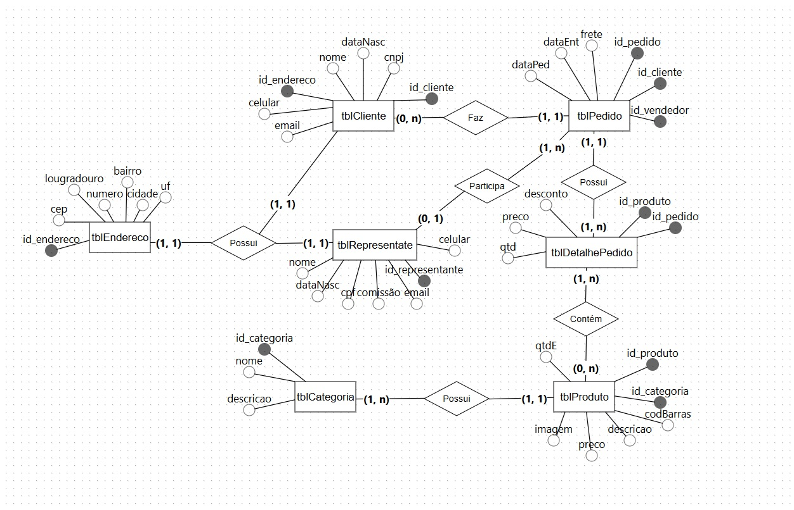

# TCM_Gustovani
TCM dos rapazes mais dedicados e lindos do 2°DS 

# 🏍️ Sistema de Gestão de Motopeças

Projeto desenvolvido em dupla como parte do curso técnico em Desenvolvimento de Sistemas.  
O sistema tem como objetivo gerenciar produtos, clientes e vendas de uma loja de motopeças, com autenticação de usuários e integração com banco de dados SQL Server.

---

## 📋 Funcionalidades

- Cadastro, listagem, edição e exclusão de **produtos**
- Cadastro e gerenciamento de **clientes e vendedores**
- Registro e controle de **pedidos**
- Sistema de **login e autenticação** de usuários
- Interface responsiva adaptada para desktop e mobile

---

## 🧠 Tecnologias Utilizadas

| Camada | Tecnologias |
|--------|--------------|
| **Front-end** | HTML, CSS, ASP.NET Web Forms (ASPX) |
| **Back-end** | C# (.NET Framework) |
| **Banco de Dados** | Microsoft SQL Server |
| **Controle de Versão** | Git e GitHub |
| **IDE** | Visual Studio |

---

## 🧱 Modelagem do Banco de Dados

O banco de dados foi normalizado até a 3ª Forma Normal.  
Principais tabelas:

- `Cliente`
- `Produto`
- `Categoria`
- `Pedido`
- `DetalhePedido`
- `Usuario`
- `Endereco`
- `Representante`

Diagrama Entidade-Relacionamento (DER):  


```text
Clientes (IdCliente, Nome, Telefone, Email, Endereco)
Produtos (IdProduto, Nome, Categoria, Preco, Estoque)
Pedidos (IdPedido, IdCliente, Data, ValorTotal)


ItensPedido (IdItem, IdPedido, IdProduto, Quantidade, Subtotal)
Usuarios (IdUsuario, Nome, Login, Senha, Tipo)

